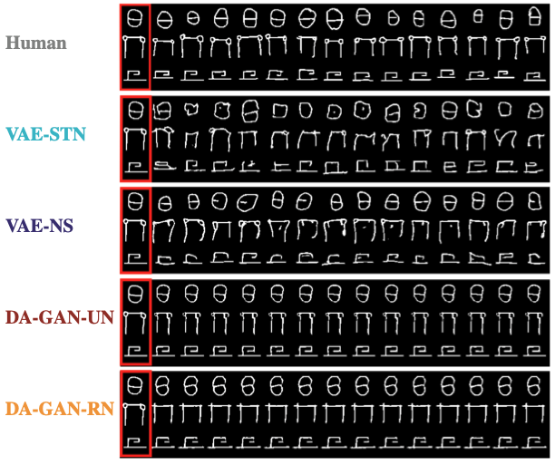

# Diversity vs. Recognizability: Human-like generalization in one-shot generative models

Link to the article : https://arxiv.org/abs/2205.10370

## 1. Quick Summary


In our Neurips2022 article entitled "Diversity vs. Recognizability: Human-like generalization in one-shot generative models", we introduce a new framework to assess one-shot generative model. The evaluation framework is based on 1) the diversity of the generated samples and 2) their recognizability.The higher the diversity and the recognizability the better the generalization ability of the generative model.
<br/>
<br/>
<br/>

Our 3 main results :
* GAN-like generative model tend to produce low-diversity but high-recognizability samples, while VAE-like models produces higher-diversity but lower-recognizability samples.
* Varying the $\beta$ parameters of the VAE-like one-shot generative models models the models on a parabolic-curves. In contrast, varying spatial attention and context have an (almost) linear effect
* The model that best approximates the human behavior is the VAE-NS that includes context integration.

<p align="center">
    
</p>


## 2. Train the one-shot generative models

Before training any generative model, you need to download the [Omniglot dataset](https://github.com/brendenlake/omniglot) [1] (the images_background.zip and images_evaluation files for python). Then unzip those files and rename the folders 'background' and 'evaluation', respectively. In the command line below, you need to specify the dataset path in `--dataset_root`.

### VAE-STN (VAE with spatial transformer [2])
```
python3 1_train_vaestn.py --device cuda:0 --z_size 80 --time_step 100 --out_dir outdir --dataset_rout dataset_root --beta 1
```
Do not forget to change `--out_dir` and `--dataset_root` args to your saving path and data path (omniglot). If you want to reproduce all the VAE-STN models presented in Fig. 3a (light blue data points), you need to run this command line and vary `--beta` from 0 to 4 (step 0.25),   `--time_step` from 20 to 90 (step 10) and `--z_size` from 10 to 400 (step 25).

Here is a gif of the one-shot generation made by the vae-stn:
<p align="center">

</p>

### VAE-NS (Neural Statistician [3])
```
python3 1_train_NS.py --device cuda:0 --model_name ns --sample-size 5 --z-dim 16 --exemplar --epoch 300 --learning_rate 1e-3 --beta 1 --out_dir outdir --dataset_root dataset_root
    
```
Do not forget to change `--out_dir` and `--dataset_root` args to your saving path and data path (omniglot). If you want ot reproduce all the VAE-NS models presented in Fig3. a, run this command line and vary `--sample-size` from 2 to 20 (step 1), `--beta` from 0 to 5 (step 0.25) and `--z_size` from 0 to 100 (step 10)


### DAGAN (Data Augmentation GAN [4])
To train the version using the ResNet Architecture (i.e. DA-GAN-RN)

```
python3 1_train_DAGAN.py --epochs 30 --device cuda:0 --c_iter 5 --z_size 128 --out_dir out_dir --dataset_root dataset_root --architecture ResNet 
```

To train the version using the UNet Architecture (i.e. DA-GAN-UN)
```
python3 1_train_DAGAN.py --epochs 30 --device cuda:0 --c_iter 5 --z_size 128 --out_dir out_dir --dataset_root dataset_root --architecture UResNet 
```

Do not forget to change `--out_dir` and `--dataset_root` args to your saving path and data path (omniglot). If you want to reproduce all the DA-GAN models presented in Fig. 3a, you need to run these command lines and vary `--z_size` from 10 to 1000 (by step of 10).

Here are some samples from the one-shot generative model trained using the command line above : 

<p align="center">
  
</p>

## 3. Train the critic networks
### SimCLR [5]
The SimCLR feature extractor is mainly used to compute the diversity metric (i.e. the x-axis of the diveristy vs. recognizability framework). To train it run the following command
```
python3 2_train_simclr.py --device cuda:3 --z_size 256 --batch_size 64 --strength normal --out_dir out_dir --dataset_root dataset_root
```
Do not forget to change `--out_dir` and `--dataset_root` args to your saving path and data path (omniglot)

### Protoypical Net [6]
The Protototypical Network is used to assess the recognizability metric (i.e. the y-axis of the diversity vs. recognizability framework). To train it, run the following command
```
python3 2_train_protonet.py --device cuda:0 --q-train 5 --k-test 20 --model_name proto_net --preload --z_size 256 --out_dir out_dir --dataset_root dataset_root
```
Do not forget to change `--out_dir` and `--dataset_root` args to your saving path and data path (omniglot)


## 4. Evaluate the one-shot generative models on the Diversity vs. Recognizability framework.
Once all you'll have all the one shot generative models trained (step 2) as well as the critic networks trained (step 3) you are ready to run the diversity vs. recognizability framework. 
To compute the diversity, just run :
```
python3 3_diversity.py --device cuda:0
```
To compute the recognizability, just run :
```
python3 3_recognizability.py --device cuda:0 
```
Those 2 python files takes the file `config.json` as a parameter. This file describes the experiment to run. Each experiment is described by a sequence of dictionary. Here is an exemple of a dictionary used to define the vae_stn experiment :
```
{
    "model": "vae_stn", ## type of the model 
    "model_name": "vae_stn_exemple", ## name of the model 
    "mode": "end", ## flag used to load the end-of-training weights (could also be best)
    "path_to_model": "./trained_model/vae_stn/", ## the path to the model
    "classifier": "prototypical_net", ## the type of classifier
    "path_to_classifier": "/media/data_cifs/projects/prj_zero_gene/neurips2022/embeddings", ## the path to the classifier
    "classifier_name": "proto_net_2022-04-05_18_59_39_z256", ## the name of the classifier
    "path_to_embedding": "./trained_model/simclr/", ## the path the feature extraction model
    "embedding": "simclr", ## the type of feature extraction model
    "embedding_model": "simclr_exemple", ## the name of the feature extraction model
    "distance": "l2" ## the distance used in the feature space to compute the diversity
}
```

Each of these 2 command lines returns a file that containing a list of dictionary. In those dictionary the key "accuracy" and "creativity" correspond to the recognizability and the diveristy, respectively. 

### Reference
[1] - Lake, Brenden M., Ruslan Salakhutdinov, and Joshua B. Tenenbaum. "Human-level concept learning through probabilistic program induction." Science 350.6266 (2015): 1332-1338.\
[2] - Rezende, Danilo, et al. "One-shot generalization in deep generative models." International conference on machine learning. PMLR, 2016.\
[3] - Edwards, Harrison, and Amos Storkey. "Towards a neural statistician." arXiv preprint arXiv:1606.02185 (2016).\
[4] - Antoniou, Antreas, Amos Storkey, and Harrison Edwards. "Data augmentation generative adversarial networks." arXiv preprint arXiv:1711.04340 (2017).\
[5] - Chen, Ting, et al. "A simple framework for contrastive learning of visual representations." International conference on machine learning. PMLR, 2020.\
[6] - Snell, Jake, Kevin Swersky, and Richard Zemel. "Prototypical networks for few-shot learning." Advances in neural information processing systems 30 (2017).


